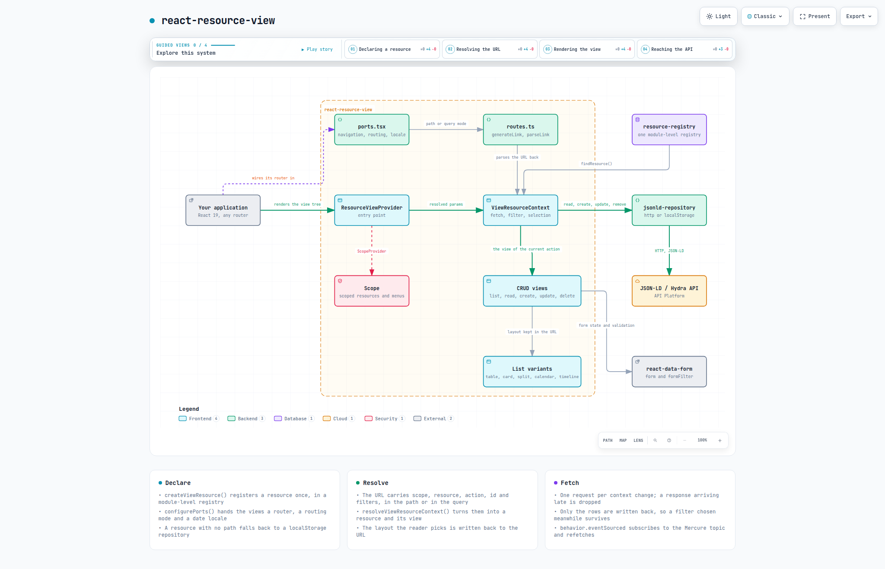

# react-resource-view

CRUD views for JSON-LD / Hydra APIs. You declare a resource — its path, its
form, its layout — and the package renders the list, the detail, the create and
edit forms, and the delete confirmation, wired to the API and to the URL.

```tsx
import { createViewResource, ResourceView } from "react-resource-view"
import { tableViewOptionFactory } from "react-resource-view"

const articles = createViewResource({
  "@id": "articles",
  path: "/api/articles",
  name: "Articles",
  view: {
    form: { inputs: { title: { label: "Title" }, body: { label: "Body" } } },
    viewVariants: [tableViewOptionFactory({ columns: ["title", "published"] })],
  },
})
```

Built on [`react-data-form`](https://github.com/SalvadorCardona/react-data-form)
for the forms and [`jsonld-repository`](https://github.com/SalvadorCardona/jsonld-repository)
for the data.

## Architecture

[](https://salvadorcardona.github.io/react-resource-view/architecture.html)

A resource is declared once and registered. The URL says which resource, which
action and which filters; the context resolves that into a view, fetches through
the resource's own repository, and renders. The package never talks to a router
or to an API itself — both arrive through `configurePorts`.

The picture above is a still of an interactive diagram:
[open it](https://salvadorcardona.github.io/react-resource-view/architecture.html)
to trace a relationship, focus a component, or follow the four guided views.

## Installation

```bash
pnpm add react-resource-view react-data-form react-mini-i18n resource-registry
```

`react`, `react-data-form`, `react-mini-i18n` and `resource-registry` are peer
dependencies. The last two own module-level singletons — a dictionary and a
registry — so they must resolve to a single copy.

### Styles

The components use [Tailwind CSS v4](https://tailwindcss.com) classes backed by
the shadcn theme variables. Tailwind must scan the compiled files:

```css
@import "tailwindcss";
@source "../node_modules/react-resource-view/dist";

/* Only if your application has no shadcn theme of its own */
@import "react-resource-view/styles.css";
```

## Connecting a router

The views navigate and build links, but the package knows no router. It asks
for four primitives, and ships an adapter for
[TanStack Router](https://tanstack.com/router):

```ts
import { configurePorts } from "react-resource-view"
import { tanstackAdapter } from "react-resource-view/tanstack"

configurePorts({ navigation: tanstackAdapter })
```

With any other router, supply the four yourself:

```ts
configurePorts({
  navigation: {
    useNavigate: () => { /* ({ to, replace, resetScroll }) => void */ },
    useLocation: () => ({ pathname, searchStr }),
    Link: ({ to, children, ...rest }) => <RouterLink to={to} {...rest}>{children}</RouterLink>,
    Navigate: ({ to, replace }) => <RouterRedirect to={to} replace={replace} />,
  },
})
```

Left unconfigured, navigation falls back to full page loads through the History
API. Enough for a test or a story, not for production.

Importing `react-resource-view/tanstack` is what pulls TanStack Router in — the
core never references it, so an application on another router installs nothing
extra.

## The rest of the configuration

```ts
configurePorts({
  appName: "My application", // page title suffix
  description: "…", // page metadata
  appUrl: "https://app.example.com", // absolute links escaping an iframe
  isDev: import.meta.env.DEV, // development affordances
})
```

The API connection is configured separately, on the client:

```ts
import { configureClient } from "jsonld-api-client"

configureClient({
  baseUrl: "https://api.example.com",
  getAuthToken: () => (isLogged() ? getUserToken() : undefined),
  getScope: () => getCurrentScope(),
})
```

## Layouts

A list renders through one of several variants, chosen with a factory:

| Factory | Layout |
| --- | --- |
| `tableViewOptionFactory` | Data table, editable in place |
| `cardViewOptionFactory` | Card grid |
| `columnViewOptionFactory` | Columns, grouped by a key |
| `splitViewFactory` | List on the left, details on the right |
| `calendarViewOptionFactory` | Calendar, by day or week |
| `timelineViewOptionFactory` | Timeline, grouped by row |
| `itemViewOptionFactory` | Plain item list |

Several variants can coexist on one resource; the view keeps the reader's
choice in the URL.

## Filters

`formFilter` declares the filter form, and `defaultFilter` the filters applied
as long as the URL carries none of its own:

```ts
view: {
  formFilter: { inputs: { published: { label: "Published" } } },
  defaultFilter: { published: true },
}
```

The distinction matters: a `defaultValue` on a filter input would not do, since
the first request goes out before the form exists — the list would then show
something other than what the filters display.

## Development

```bash
pnpm install
pnpm test
pnpm typecheck
pnpm lint
pnpm build
```

### The architecture diagram

The diagram is generated by [archify](https://github.com/tt-a1i/archify) from
`diagrams/react-resource-view.architecture.json`. The renderer is installed
rather than vendored; `skills-lock.json` records the version it came from:

```bash
npx skills add tt-a1i/archify --skill archify --agent claude-code --copy
ARCHIFY=.claude/skills/archify/bin/archify.mjs

# Rebuild the interactive artefact the documentation site serves
node $ARCHIFY deliver architecture \
  diagrams/react-resource-view.architecture.json \
  website/public/architecture.html --quality showcase

# Recapture the still the README shows, and keep the 2048x1320 light one
node $ARCHIFY visual-check website/public/architecture.html
cp website/public/architecture.visual-check.2048x1320.light.png \
  diagrams/react-resource-view.png
rm website/public/architecture.visual-check.*
```

`deliver` refuses to write an artefact that fails its own layout and
composition checks, so a diagram that lands is a diagram that reads.

## License

MIT
