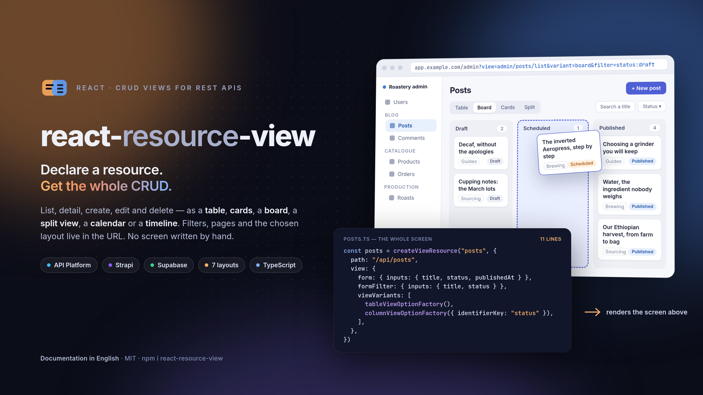

<p align="center">
  <a href="https://salvadorcardona.github.io/react-resource-view/playground">
    
  </a>
</p>

<p align="center">
  <a href="https://www.npmjs.com/package/react-resource-view"></a>
  <a href="https://github.com/SalvadorCardona/react-resource-view/blob/main/LICENSE"></a>
  <a href="https://salvadorcardona.github.io/react-resource-view/playground"></a>
</p>

# react-resource-view

CRUD views for REST APIs — API Platform, Strapi, Supabase. You declare a
resource — its path, its form, its layout — and the package renders the list,
the detail, the create and edit forms, and the delete confirmation, wired to
the API and to the URL.

```tsx
import { createViewResource, ResourceView } from "react-resource-view"
import { tableViewOptionFactory } from "react-resource-view"

const articles = createViewResource("articles", {
  path: "/api/articles",
  name: "Articles",
  view: {
    form: { inputs: { title: { label: "Title" }, body: { label: "Body" } } },
    viewVariants: [tableViewOptionFactory()],
  },
})
```

Built on [`react-data-form`](https://github.com/SalvadorCardona/react-data-form)
for the forms. Which API answers, and how it spells a page or a filter, is a
[dialect](#connecting-an-api) — JSON-LD is the default, not a requirement.

## Documentation

Everything below, at length and with the examples running rather than quoted:
[the documentation site](https://salvadorcardona.github.io/react-resource-view/docs/resource-view)
— a page per layout, per filter, per dialect — and a
[playground](https://salvadorcardona.github.io/react-resource-view/playground):
a whole back office built from seven resource declarations, every edit real,
every screen a URL, and the source of each screen one click away.

## Architecture

[](https://salvadorcardona.github.io/react-resource-view/architecture.html)

A resource is declared once and registered. The URL says which resource, which
action and which filters; the context resolves that into a view, fetches through
the resource's own repository, and renders. The package never talks to a router
itself, nor to one API in particular: the router arrives through
`configurePorts`, the API through `configureApi`.

The picture above is a still of an interactive diagram:
[open it](https://salvadorcardona.github.io/react-resource-view/architecture.html)
to trace a relationship, focus a component, or follow the four guided views.

## Connecting an API

The views know a resource has rows, pages and filters. How a given backend
spells those — the URL an item lives at, the query string a filter becomes, the
envelope a collection arrives in, where the validation errors hide — is a
**dialect**, set once at startup:

```ts
import { configureApi, strapiDialect } from "react-resource-view"

configureApi({
  baseUrl: "https://cms.example.com",
  getAuthToken: () => (isLogged() ? getUserToken() : undefined),
  dialect: strapiDialect(),
})
```

| Dialect             | Backend             | What it knows                                                                                                |
| ------------------- | ------------------- | ------------------------------------------------------------------------------------------------------------ |
| `jsonLdDialect()`   | API Platform, Hydra | `member` / `totalItems`, IRIs, `page` and `itemsPerPage`, Hydra `violations`, Mercure, CSV export            |
| `strapiDialect()`   | Strapi v4 and v5    | `pagination[page]`, `filters[field][$eq]`, `sort[0]`, `populate`, writes under `data`, `documentId`          |
| `supabaseDialect()` | Supabase, PostgREST | `limit` / `offset`, `field=eq.value`, `order`, the count in `Content-Range`, `Prefer: return=representation` |

JSON-LD is the default, so an application already talking to API Platform needs
none of this — and keeps going through the client it configured with
`configureClient` (see [The rest of the configuration](#the-rest-of-the-configuration)).

### Strapi

```ts
import { configureApi, strapiDialect, createViewResource } from "react-resource-view"

configureApi({
  baseUrl: "https://cms.example.com",
  getAuthToken: () => getApiToken(),
  dialect: strapiDialect(),
})

const articles = createViewResource("articles", {
  path: "articles", // → /api/articles
  name: "Articles",
  view: {
    form: { inputs: { title: { label: "Title" } } },
    itemsPerPage: 25,
  },
})
```

`strapiDialect` takes `apiPath` (default `/api`), `populate` (default `"*"` —
without it the relation columns come back empty), `identifier` (`documentId` on
v5, `id` on v4) and `defaultOperator` (`$eq`; pass `$containsi` to make every
text filter a case-insensitive search). The v4 `{ id, attributes }` envelope is
flattened on the way in, so a resource declared once reads the same on both
versions.

### Supabase

```ts
import {
  configureApi,
  supabaseDialect,
  createViewResource,
} from "react-resource-view"

configureApi({
  baseUrl: "https://xyzcompany.supabase.co",
  getAuthToken: () => getSession()?.access_token,
  dialect: supabaseDialect({ apiKey: import.meta.env.VITE_SUPABASE_ANON_KEY }),
})

const articles = createViewResource("articles", {
  path: "articles", // → /rest/v1/articles
  name: "Articles",
  view: { form: { inputs: { title: { label: "Title" } } } },
})
```

`supabaseDialect` takes `apiKey` (a value or a function), `primaryKey` (default
`id` — PostgREST addresses a row by a filter on it, having no item route),
`select` (default `*`; `"*,author(*)"` embeds a relation), `schema`,
`defaultTextOperator` and `restPath`.

### Two backends at once

A resource may carry a dialect of its own, which wins over the configured one:

```ts
const invoices = createViewResource("invoices", {
  path: "invoices",
  dialect: supabaseDialect({ apiKey }),
})
```

### Filters, pages and sorts

They are written once, in the package's own vocabulary, and the dialect
translates them:

| Key                 | Means              | Strapi                 | Supabase          |
| ------------------- | ------------------ | ---------------------- | ----------------- |
| `page`              | 1-based page       | `pagination[page]`     | `offset`          |
| `itemsPerPage`      | rows per page      | `pagination[pageSize]` | `limit`           |
| `order`             | `{ title: "asc" }` | `sort[0]=title:asc`    | `order=title.asc` |
| `title: "hello"`    | a field            | `filters[title][$eq]`  | `title=eq.hello`  |
| `status: ["a","b"]` | any of             | `filters[status][$in]` | `status=in.(a,b)` |

A value spelled as an object carries its own operator through untouched —
`{ title: { $containsi: "hell" } }` on Strapi, `{ createdAt: { gte: "2024-01-01" } }`
on Supabase.

### Another API entirely

A dialect is one object — `buildRequest`, `readCollection`, `readItem`,
`getId`, `getIdentifier`, `normalizeError` — and `ApiDialectInterface` is
exported to implement it. A resource that brings its own `getCollection`,
`getItem` and the rest still bypasses all of this, as it always could.

## Installation

```bash
pnpm add react-resource-view react-data-form react-mini-i18n resource-registry
```

`react`, `react-data-form`, `react-mini-i18n` and `resource-registry` are peer
dependencies. The last two own module-level singletons — a dictionary and a
registry — so they must resolve to a single copy.

### Styles

The components use [Tailwind CSS v4](https://tailwindcss.com) classes backed by
the shadcn theme variables. Tailwind must scan the compiled files:

```css
@import "tailwindcss";
@source "../node_modules/react-resource-view/dist";

/* Only if your application has no shadcn theme of its own */
@import "react-resource-view/styles.css";
```

## Connecting a router

The views navigate and build links, but the package knows no router. It asks
for four primitives, and ships an adapter for
[TanStack Router](https://tanstack.com/router):

```ts
import { configurePorts } from "react-resource-view"
import { tanstackAdapter } from "react-resource-view/tanstack"

configurePorts({ navigation: tanstackAdapter })
```

With any other router, supply the four yourself:

```ts
configurePorts({
  navigation: {
    useNavigate: () => { /* ({ to, replace, resetScroll }) => void */ },
    useLocation: () => ({ pathname, searchStr }),
    Link: ({ to, children, ...rest }) => <RouterLink to={to} {...rest}>{children}</RouterLink>,
    Navigate: ({ to, replace }) => <RouterRedirect to={to} replace={replace} />,
  },
})
```

Left unconfigured, navigation falls back to full page loads through the History
API. Enough for a test or a story, not for production.

Importing `react-resource-view/tanstack` is what pulls TanStack Router in — the
core never references it, so an application on another router installs nothing
extra.

## The rest of the configuration

```ts
configurePorts({
  appName: "My application", // page title suffix
  description: "…", // page metadata
  appUrl: "https://app.example.com", // absolute links escaping an iframe
  isDev: import.meta.env.DEV, // development affordances
})
```

The API connection is configured separately, through
[`configureApi`](#connecting-an-api). On the JSON-LD dialect it can also come
from the client itself, which is what an existing API Platform application
already does:

```ts
import { configureClient } from "jsonld-api-client"

configureClient({
  baseUrl: "https://api.example.com",
  getAuthToken: () => (isLogged() ? getUserToken() : undefined),
  getScope: () => getCurrentScope(),
})
```

`configureApi` falls back to those settings when it is given none of its own,
so nothing has to move.

## Layouts

A list renders through one of several variants, chosen with a factory:

| Factory                     | Layout                                 |
| --------------------------- | -------------------------------------- |
| `tableViewOptionFactory`    | Data table, editable in place          |
| `cardViewOptionFactory`     | Card grid                              |
| `columnViewOptionFactory`   | Columns, grouped by a key              |
| `splitViewFactory`          | List on the left, details on the right |
| `calendarViewOptionFactory` | Calendar, by day or week               |
| `timelineViewOptionFactory` | Timeline, grouped by row               |
| `itemViewOptionFactory`     | Plain item list                        |

Several variants can coexist on one resource; the view keeps the reader's
choice in the URL.

### A layout of your own

A variant is a `createView` call over three components, so the eighth layout is
a single file — and one command writes it:

```bash
npx react-resource-view create-view-variant Heatmap --dir src/views
```

Run it bare and it asks for the name and the directory. It writes
`src/views/heatmapViewFactory.tsx`: the list, row and item components, the
factory that declares them, and the options interface to extend. Nothing is
registered anywhere — declare the factory in `viewVariants` beside the built-in
ones:

```ts
import heatmapViewFactory from "./views/heatmapViewFactory"

view: {
  viewVariants: [tableViewOptionFactory(), heatmapViewFactory()],
}
```

`--icon <LucideIcon>` picks the switcher's icon, `--jsx` writes JavaScript,
`--dry-run` prints the file instead of writing it, and `--yes` never asks — see
`npx react-resource-view --help`. [Create your own view
variant](https://salvadorcardona.github.io/react-resource-view/docs/resource-view/custom-variant)
takes the generated file apart, and runs one.

## Filters

`formFilter` declares the filter form, and `defaultFilter` the filters applied
as long as the URL carries none of its own. Both are written in the package's
own vocabulary; the [dialect](#filters-pages-and-sorts) translates them for the
API:

```ts
view: {
  formFilter: { inputs: { published: { label: "Published" } } },
  defaultFilter: { published: true },
}
```

The distinction matters: a `defaultValue` on a filter input would not do, since
the first request goes out before the form exists — the list would then show
something other than what the filters display.

## Development

```bash
pnpm install
pnpm test
pnpm typecheck
pnpm lint
pnpm build
```

### The architecture diagram

The diagram is generated by [archify](https://github.com/tt-a1i/archify) from
`diagrams/react-resource-view.architecture.json`. The renderer is installed
rather than vendored; `skills-lock.json` records the version it came from:

```bash
npx skills add tt-a1i/archify --skill archify --agent claude-code --copy
ARCHIFY=.claude/skills/archify/bin/archify.mjs

# Rebuild the interactive artefact the documentation site serves
node $ARCHIFY deliver architecture \
  diagrams/react-resource-view.architecture.json \
  website/public/architecture.html --quality showcase

# Recapture the still the README shows, and keep the 2048x1320 light one
node $ARCHIFY visual-check website/public/architecture.html
cp website/public/architecture.visual-check.2048x1320.light.png \
  diagrams/react-resource-view.png
rm website/public/architecture.visual-check.*
```

`deliver` refuses to write an artefact that fails its own layout and
composition checks, so a diagram that lands is a diagram that reads.

## Author

Written and maintained by Salvador Cardona — full-stack web developer. The rest
of his work, and how to reach him, is on [cardona.digital](https://cardona.digital).

## License

MIT
